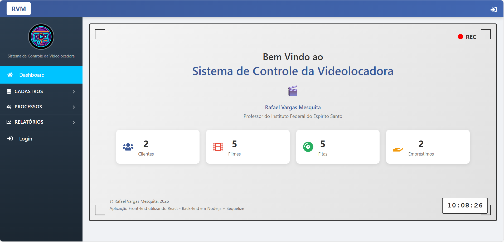

<h1 align="center">
    
</h1>

<h3 align="center">
  Sistema de Controle da Videolocadora - FrontEnd - React
</h3>

Exemplo de um Sistema para Gerenciamento de Locadora

  

  

  

  

  <a href="#-instalacao">Instalação e execução</a>&nbsp;&nbsp;&nbsp;|&nbsp;&nbsp;&nbsp;
  <a href="#-telas">Telas</a>&nbsp;&nbsp;&nbsp;|&nbsp;&nbsp;&nbsp;
  <a href="#-links">Links</a>&nbsp;&nbsp;&nbsp;|&nbsp;&nbsp;&nbsp;
  <a href="#-licenca">Licença</a>

## :computer: Instalação e execução 

0. Instale o gerenciador de dependências [Node](https://nodejs.org/en/download/);
1. Faça um clone desse repositório;
2. Entre na pasta rodando `cd scv-frontend-react`;
3. Rode `npm install` para instalar as dependências;
4. Rode `npm start` para iniciar o servidor de desenvolvimento;
5. Abra `http://localhost:3001` para ver o projeto no navegador.

## :clapper: Tela(s) 

## :link: Links 

- [Render](https://scv-backend-node-sequelize.onrender.com) - Implantação do SCV Backend Node Sequelize;

## :memo: Licença 

Esse projeto está sob a licença MIT. Veja o arquivo [LICENSE](LICENSE.md) para mais detalhes.

## :email: Contato

Rafael Vargas Mesquita - [GitHub](https://github.com/ravarmes) - [LinkedIn](https://www.linkedin.com/in/rafael-vargas-mesquita) - [Lattes](http://lattes.cnpq.br/6616283627544820) - **ravarmes@hotmail.com**

---

Feito com ♥ by Rafael Vargas Mesquita :wink:
